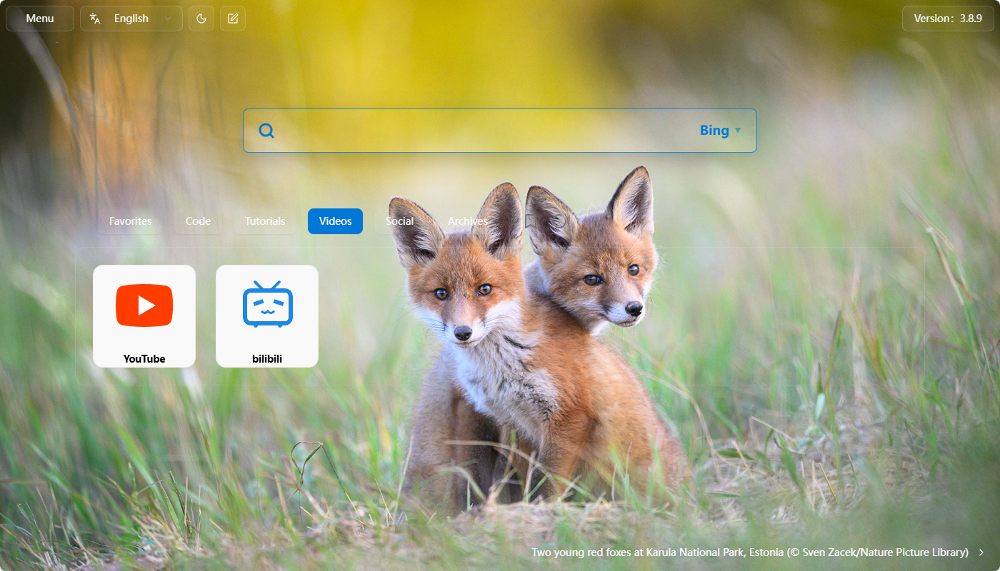

# HomePage - Edge 主页插件
[](https://github.com/volzhang/HomePage/blob/main/LICENSE)
[](https://vitejs.dev/)
[](https://www.typescriptlang.org/)
[](https://github.com/volzhang/HomePage)

个人学习项目：纯前端实现的浏览器新标签页。

## 截图


## 功能
- **搜索引擎**：支持 Google、Bing 等多引擎快速切换
- **自定义壁纸**：支持上传壁纸，修改起始页背景
- **自定义瓷砖**：拖拽排序、可视化快捷链接，像桌面图标一样方便
- **支持 中文/英语**：自动检测或手动切换，双语界面

## 技术栈
- Vite TypeScript React
- Localforage Zustand i18n

## 如何本地运行

方法1） 直接体验
https://volzhang.com

方法2） 下载edge插件
https://microsoftedge.microsoft.com/addons/detail/%E4%B8%BB%E9%A1%B5/gblipikohcegedalbnljafomaadhdjdp

方法3）
```bash
git clone https://github.com/volzhang/HomePage.git
cd HomePage
pnpm install
pnpm dev
```

## 作为 Edge/Chrome 扩展安装（开发者模式）
1. 下载本仓库中 dist 文件夹
2. 打开 Edge → 扩展 → 打开“开发者模式”
3. 点击“加载已解压的扩展程序” → 选择 dist 文件夹
4. 在"来自其他源"中找到本扩展（Home Page 或 主页），点击启用

注意，请关闭其他修改起始页功能的插件，避免冲突。


